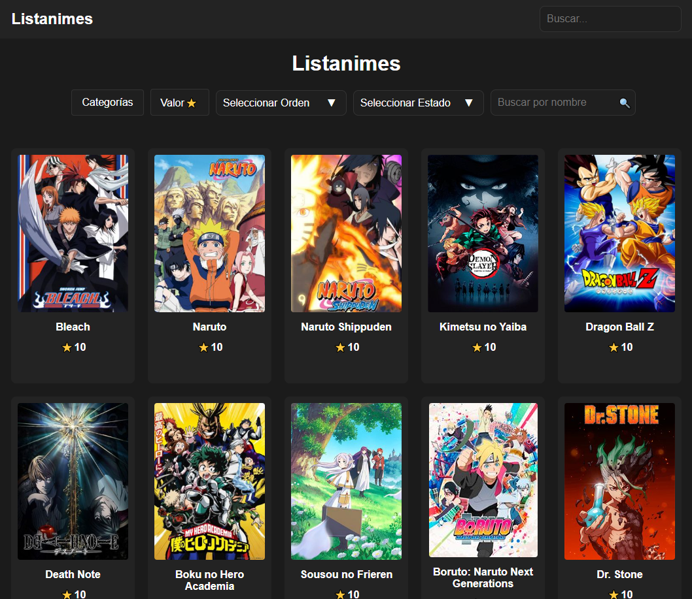
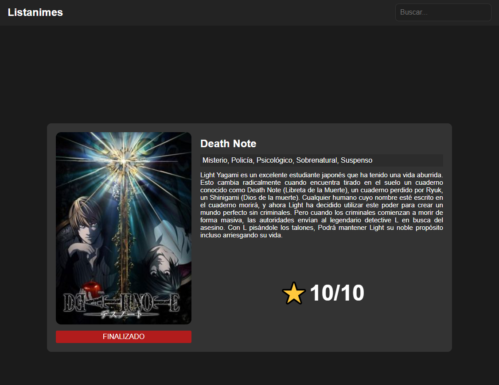
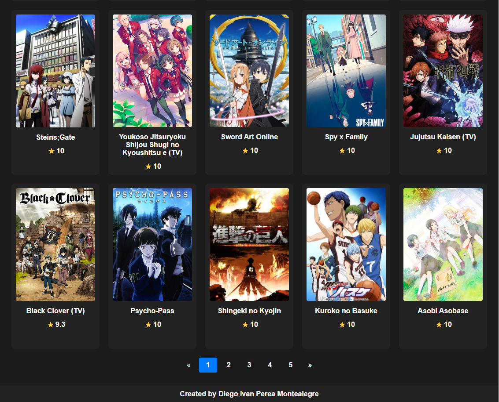
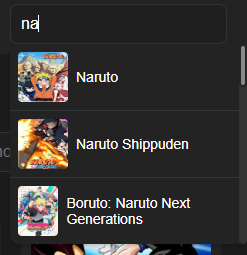

# Lista Anime

<p align="justify">
Anime list where you can filter anime by categories, value, order and status. In addition you can search by name and enter and its information sheet where you can see the information of the anime in Spanish, categories, title, state and its corresponding image.
</p>

<p align="justify">
Listado de animes donde podrás filtrar los animes por categorías, valor, orden y estado. Además puedes buscar por nombre y entrar en su ficha informativa donde podrás ver la información del anime en español, categorías, título, estado y su imagen correspondiente.
</p>

<p align="center">
  
</p>

<p align="center">
  
</p>

<p align="center">
  
</p>

<p align="center">
  
</p>


This is a [Next.js](https://nextjs.org/) project bootstrapped with [`create-next-app`](https://github.com/vercel/next.js/tree/canary/packages/create-next-app).

## Getting Started

First
```bash
npm install
```
run the development server:
```bash
npm run dev
# or
yarn dev
# or
pnpm dev
# or
bun dev
```

Open [http://localhost:3000](http://localhost:3000) with your browser to see the result.


<p align="justify">
In the value filter is between a minimum and maximum to select where by default is from 0 to 10, in the order filter is to order the list of anime from where its name begins from A to Z, from Z to A and the value in ascending and descending order.

The status filter sorts the list of anime by status Completed or Active, and the search by name filter sorts the list of anime by the name or word entered.

The search by name filter in the header part sorts the list of anime by the name or word entered so that they appear below and can be selected, making the component reusable in other media.
</p>

----
**Spanish**
<p align="justify">
En el filtro de valor es entre un mínimo y un máximo a seleccionar donde por defecto es de 0 a 10, en el filtro de orden es para ordenar la lista de anime desde donde empieza su nombre de la A a la Z, de la Z a la A y el valor en orden ascendente y descendente.

El filtro de estado ordena la lista de anime por estado Finalizado o Activo, y el filtro de búsqueda por nombre ordena la lista de anime por el nombre o palabra introducida.

El filtro de búsqueda por nombre en la parte del cabecera(Header) ordena la lista de anime por el nombre o palabra introducida de forma que aparezcan debajo y puedan ser seleccionados, haciendo que el componente sea reutilizable en otros medios.
</p>

Created by [Diego Ivan Perea Montealegre](https://github.com/diegoperea20)


